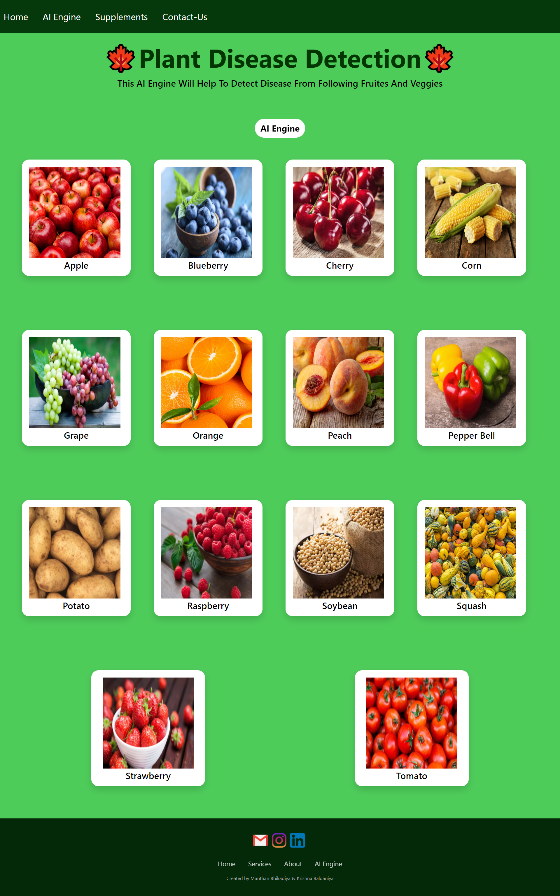
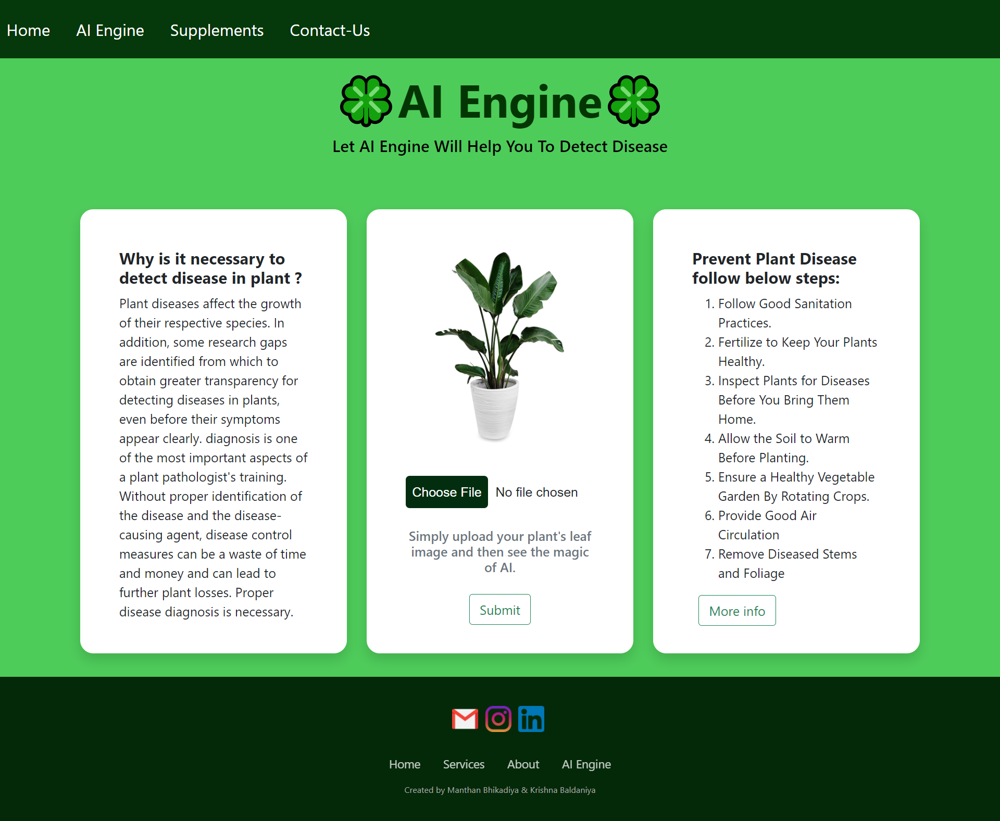
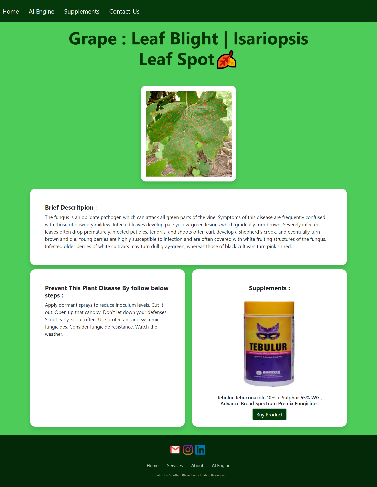

# ⭐Plant-Disease-Detection
* Plant Disease is necessary for every farmer so we are created Plant disease detection using Deep learning. In which we are using convolutional Neural Network for classifying Leaf images into 39 Different Categories. The Convolutional Neural Code build in Pytorch Framework. For Training we are using Plant village dataset. Dataset Link is in My Blog Section.

## ⭐Contributors

## ⭐Technologies and Tools Used

### Backend
- **Python 3.8+** - Core programming language
- **Flask** - Web framework for building the application
- **PyTorch** - Deep learning framework for CNN model
- **torchvision** - Computer vision library for image processing
- **NumPy** - Numerical computation library
- **Pandas** - Data manipulation and analysis
- **Pillow (PIL)** - Image processing library
- **Google Generative AI** - For Gemini AI-powered chatbot
- **Werkzeug** - Utilities for Flask applications
- **gunicorn** - WSGI HTTP Server for deployment

### Frontend
- **HTML5/CSS3** - Markup and styling
- **JavaScript** - Client-side scripting
- **Bootstrap** - Responsive design framework
- **AJAX** - Asynchronous JavaScript for API calls

### Deployment Options
- **PythonAnywhere** - Cloud platform for hosting Python applications
- **Render.com** - Cloud platform for web services
- **Heroku** - Cloud platform as a service

### Data Files
- **disease_info.csv** - Information about plant diseases
- **supplement_info.csv** - Information about supplements and treatments
- **plant_disease_model_1_latest.pt** - Pre-trained CNN model

## ⭐Run Project in your Machine
* You must have **Python3.8** or newer installed in your machine.
* Create a Python Virtual Environment & Activate it:
  ```
  python -m venv venv
  source venv/bin/activate  # On Windows: venv\Scripts\activate
  ```
* Install all the dependencies:
  ```
  pip install -r requirements.txt
  ```
* Go to the `Flask Deployed App` folder:
  ```
  cd Flask\ Deployed\ App
  ```
* Download the pre-trained model file `plant_disease_model_1_latest.pt` from [here](https://drive.google.com/drive/folders/1ewJWAiduGuld_9oGSrTuLumg9y62qS6A?usp=share_link)
* Add the downloaded file in `Flask Deployed App` folder.
* Set up your Google Gemini API key:
  1. Get API key from [Google AI Studio](https://makersuite.google.com/)
  2. Open `app.py` and add your API key or set as environment variable:
     ```
     export GOOGLE_API_KEY="your-api-key-here"
     ```
* Run the Flask app:
  ```
  python app.py
  ```
* Open your browser and go to `http://127.0.0.1:5000/`

## ⭐Deploying to PythonAnywhere

1. **Create a PythonAnywhere account**:
   - Sign up at [pythonanywhere.com](https://www.pythonanywhere.com)

2. **Upload your project**:
   - Log in to PythonAnywhere
   - Go to the "Files" tab
   - Create a folder for your project (e.g., `plant-disease-detection`)
   - Upload your project files (you can zip them for easier upload)

3. **Set up a virtual environment**:
   - Open a Bash console (click "Bash" under the "Consoles" tab)
   - Create and activate a virtual environment:
     ```
     $ cd plant-disease-detection
     $ python3 -m venv venv
     $ source venv/bin/activate
     $ pip install -r "Flask Deployed App/requirements.txt"
     ```

4. **Configure a Web App**:
   - Go to the "Web" tab
   - Click "Add a new web app"
   - Select "Manual configuration"
   - Choose Python version (3.8 or later)
   - Configure the WSGI file as instructed in the web interface
   - Set up static files mapping for `/static/` directory

5. **Set environment variables**:
   - In the "Web" tab, add your GOOGLE_API_KEY

6. **Reload your web app**:
   - Click the "Reload" button for your web app

## ⭐How the Chatbot Works

Our AI Plant Doctor chatbot combines multiple technologies to provide intelligent responses:

1. **User Interface**:
   - Clean, ChatGPT-style interface for easy interaction
   - Supports text questions and image uploads
   - Available in Hindi, English, and Hinglish

2. **Backend Processing**:
   - Questions are sent to the Google Gemini AI API
   - Images are analyzed for plant diseases using our CNN model
   - Results are combined to provide comprehensive advice

3. **Features**:
   - **Disease Identification**: Upload leaf images to identify diseases
   - **Treatment Advice**: Get specific remedies and prevention tips
   - **Multilingual Support**: Communicate in your preferred language
   - **Context Awareness**: The AI remembers previous questions in your session
   - **Visual Analysis**: Get insights from both your questions and images

4. **Example Usage**:
   - Ask about specific diseases: "What are early signs of tomato blight?"
   - Upload images with questions: "What's wrong with my plant?"
   - Get treatment advice: "How do I treat powdery mildew on roses?"
   - Prevention tips: "How can I prevent apple scab disease?"

## ⭐Contribution ( Open Source )
* This Project is now open source.
* All the developers who are intrested they can contribute in this project.
* Yo can make UI better , make Deep learning model more powerful , add informative markdown file in section...
* If you will change Deep learning make sure you upload updated markdown file (.md) , .pdf and .ipynb in particular section.
* Make sure your code is working. It will not have any type or error.
* You have to fork this project then make a pull request after you testing will successful.
* How to make pull request : https://opensource.com/article/19/7/create-pull-request-github


## ⭐Testing Images

* If you do not have leaf images then you can use test images located in test_images folder
* Each image has its corresponding disease name, so you can verify whether the model is working perfectly or not

## ⭐Blog Link
<a href="https://medium.com/analytics-vidhya/plant-disease-detection-using-convolutional-neural-networks-and-pytorch-87c00c54c88f" target = "_blank">Plant Disease Detection Using Convolutional Neural Networks with PyTorch</a><br>

## ⭐Deployed App
<a href="https://plant-disease-detection-ai.herokuapp.com/" target = "_blank">Plant-Disease-Detection-AI</a><br>


## ⭐Snippet of Web App :
#### Main page
 <br>
#### AI Engine 
 <br>
#### Results Page 
 <br>
#### Supplements/Fertilizer  Store
 <br>
#### Contact Us 
 <br>
#### AI Chatbot
 <br><br>

# AI Plant Disease Detection with Chatbot

This project combines plant disease detection using deep learning with an AI-powered chatbot that helps users understand plant health issues and solutions.

## Features

- **Plant Disease Detection**: Upload images of plant leaves to detect diseases
- **AI Chatbot**: Get expert advice on plant health using Google's Gemini AI
- **Treatment Recommendations**: Find supplements and treatments for detected diseases
- **Multilingual Support**: Chat in Hindi/Hinglish for better accessibility

## Setting Up the Gemini AI Chatbot

1. **Get a Gemini API Key**:
   - Visit [Google AI Studio](https://makersuite.google.com/)
   - Create an account and generate an API key

2. **Configure the API Key**:
   - Open `app.py`
   - Replace `YOUR_GEMINI_API_KEY_HERE` with your actual Gemini API key

3. **Install Required Packages**:
   ```
   pip install -r requirements.txt
   ```

4. **Run the Application**:
   ```
   python app.py
   ```

## Using the Chatbot

1. Navigate to the "AI Chat" section in the navigation menu
2. Type your plant health questions in Hindi or English
3. Get expert advice tailored to your specific plant health concerns
4. You can ask questions like:
   - "मेरे टमाटर के पौधे की पत्तियों पर काले धब्बे हैं, क्या करूं?"
   - "How can I prevent apple cedar rust disease?"
   - "Mera aam ka pedh kuch din se sukh raha hai, kya upay hai?"

## Technical Details

- **Frontend**: HTML, CSS, JavaScript, Bootstrap
- **Backend**: Flask (Python)
- **AI Model**: CNN for image classification, Gemini 1.5 Pro for natural language processing
- **Language Support**: Hindi, English, Hinglish
